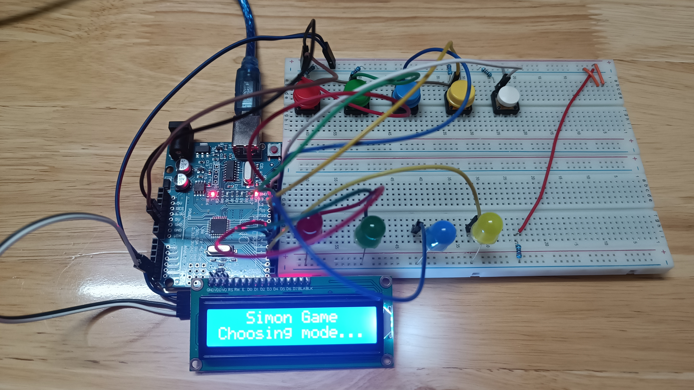
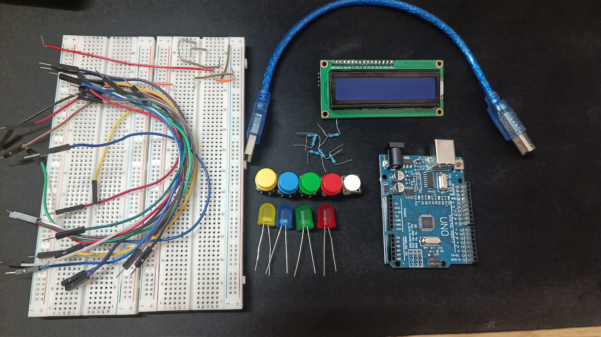

<h1 style="text-align: center;">Arduino - Simon Game</h1>

# INTRODUCTION

This is an Arduino Simon Game created based on traditional Simon Game! This is a classic memory-based game built using Arduino and some basic electronic components. The game features three exciting modes that will challenge your memory and you can also play with friends.



# GAMEPLAY

### Single Player Mode
In this mode, players will test their memory by following a sequence of LED (light) patterns. The game starts with a random LED lighting up, and the player must press the corresponding colored button. With each successful round, the sequence becomes longer and more challenging. The player's objective is to remember and replicate the sequence correctly.

### Two Player Mode
Two players can compete against each other in this mode. Each player takes turns to play the LED sequence and also set up an LED of their choice. This mode encourages quick thinking and strategic choices so as to outsmart your opponent.

### 'Simon Says' Mode
Inspired by the classic "Simon says" game, this mode introduces a text twist. The player should only press the colored button if the text "Simon says" is displayed. The challenging task here is that the player only have 2 seconds to choose the correct colored button following the text. If there's another piece of text beside the given text, and the player still presses the button, they lose the round. This mode tests both memory and attention to detail.

# BASIC COMPONENTS

To build the Arduino Simon Game, you'll need the following components:

- 4 color buttons (Red, Green, Blue, Yellow).
- 1 white button (for Simon Says mode).
- 4 different color LEDs (Red, Green, Blue, Yellow).
- 6 resistors.
- LCD 1602 with I2C Module.
- Wires for connections.
- 1 Arduino Uno R3, a wire to load the code.
- Some breadboards.



## WIRING CONNECTION

Connect the components as follows:

- Connect each color button to a digital input pin on the Arduino, in this specific code I use pin 8 --> 11, from yellow, blue, green to red respectively.
- Connect the white button to another digital input pin (12) on the Arduino, this is the SELECT button.
- Connect each LED to a digital output pin on the Arduino, in this specific code I use pin 2 --> 5, from yellow, blue, green to red respectively.
- SDA and SCL of LCD are connected to A4 and A5 pin respectively, and VCC is 5V.
- Make sure to use appropriate current-limiting resistors for the LEDs (220 ohms are used).
- If you wish you can use some 0.1uF capacitors and resistors for debouncing buttons.

### Note: 
You can use 9V battery along with Battery Connector to DC Jack Arduino to power the system. 


Here's a simplified diagram:
| Components    | Pin |
|-------------- |:---:|
| Yellow Button |  8  |
| Blue Button   |  9  |
| Green Button  |  10 |
| Red Button    |  11 |
| White Button  |  12 |
| Yellow LED    |  2  |
| Green LED     |  3  |
| Blue LED      |  4  |
| Red LED       |  5  |
| SDA           |  A4 |
| SCL           |  A5 |

# SETTING 

### Arduino IDE
1. Copy all the code in /src/main.cpp
2. Create a project in Arduino IDE and paste all the code in.
3. Install LiquidCrystal_I2C library
4. Prepare and connect all necessary components.
5. Upload this code into the Arduino


### Other IDE
1. Fork/Clone this project into your computer. (Recommendation: Using Visual Studio Code)
2. Download extension PlatformIO and open the project.
3. Download LiquidCrystal_I2C library and add to the project.
3. Prepare and connect all necessary components.
5. Open platformio.ini to check information and change the correct connection port.
6. Upload this code into the Arduino

```cpp
//platformio.ini
platform = atmelavr
board = uno
framework = arduino
upload_port = COMx   
```

# CREDITS

This project was inspired by the classic Simon Game and transferred to Arduino by DucTriCE. Have fun playing and explore as much as you wish!

---

Enjoy your time with the Arduino Simon Game! If you have any questions, improvements, or suggestions, feel free to contribute to the project or contact me through my github: https://github.com/DucTriCE

